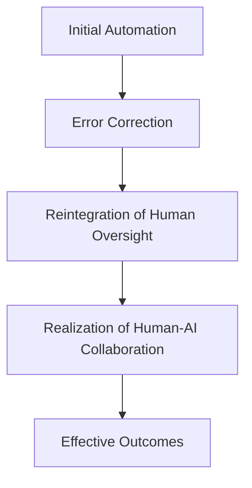

When AI was first introduced as a tool to boost productivity, the promise was clear: machines would handle the tedious, repetitive tasks, freeing humans to focus on higher-value work. But as more companies adopted AI, a troubling pattern began to emerge. The expected gains in efficiency were often offset by new inefficiencies, errors, and the realization that human oversight was not just helpful—but essential. The so-called “product nadir” has led to a growing recognition that AI, despite its capabilities, cannot replace the nuanced judgment, adaptability, and creativity that humans bring to the table.

Studies have shown that while AI can save time, a significant portion of that time is spent correcting its mistakes. For instance, a study found that 40% of the time saved from AI is spent fixing errors. This is not just a minor inconvenience; it represents a productivity paradox where AI creates new tasks while streamlining others. In software development, AI-assisted coding often leads to code-quality regressions and rework, especially in complex projects. Senior engineers find themselves spending substantial time fact-checking AI output for subtle errors. The initial gains from AI are quickly undermined by the need for human intervention and oversight.

Despite these challenges, many companies initially pursued full automation, believing that AI could replace human workers entirely. However, this approach has led to significant failures. For example, a financial technology company experienced increased customer dissatisfaction and operational errors after pursuing full AI automation. Similarly, McDonald’s faced operational errors and customer dissatisfaction after automating its order fulfillment system, which eventually required a significant reintegration of human oversight to restore service quality. These companies eventually realized that human support was crucial for maintaining quality and customer satisfaction. This realization was not limited to these cases; enterprise AI rollouts often fail due to poor change management, insufficient training, and over-reliance on automation. The assumption that AI could replace humans in all aspects of workflows has led to regrettable outcomes, including layoffs that were later reversed as the need for human oversight became clear.

The problem is not just about the limitations of AI, but also about how humans are being treated in the process. In AI compliance systems, human reviewers often become passive and disengaged, suffering from what is known as “automation bias”. This bias leads to a “vigilance decrement,” where humans monitoring reliable AI systems become less attentive over time. This passive monitoring can have serious consequences, especially in high-stakes environments like autonomous vehicles. The fatal self-driving Uber collision is a stark example of how human disengagement can lead to critical errors.

To address this, we need a more deliberate and structured approach to human-AI collaboration. This means not only recognizing the limitations of AI but also designing systems that support human engagement and vigilance. As AI systems become more reliable, human monitoring must be restructured to ensure that it remains active and effective. For example, some organizations have introduced periodic refresher training and active engagement protocols to combat automation bias and maintain human vigilance.

So, what is the solution? The answer lies in revisiting the original goal of automation: to augment, not replace, human capabilities. Automation has always aimed to improve efficiency and ease the burden of human work, from the wheel to assembly lines. The future of AI is not in full automation, but in collaboration—where humans guide and refine AI’s work. The “human-in-the-loop” model, where humans edit and refine AI outputs, yields the best results in terms of quality and tone. Human intuition, adaptability, and judgment are essential in complex, uncertain scenarios. These qualities are irreplaceable and critical in ensuring that AI systems are used effectively and ethically.

The key to successful AI integration is not to eliminate human oversight, but to integrate it in a way that complements AI’s strengths. This requires a shift in mindset—from viewing AI as a replacement for humans to seeing it as a partner in the workflow. Human-AI collaboration is not just a trend; it is a necessity. McKinsey estimates that generative AI could add $2.6 trillion to $4.4 trillion annually to the global economy across 63 use cases. This potential is only realized when AI and humans work together, with humans setting intent and owning accountability for outcomes.

In conclusion, the re-emergence of the human layer in AI workflows is not a regression, but a necessary correction. The productivity paradox highlights the importance of balancing automation with human oversight. As companies continue to adopt AI, they must recognize that the most effective outcomes come from collaboration, not replacement. The future of AI is not in full automation, but in partnership—with humans guiding and refining AI’s work to achieve the best results.

This process illustrates how the journey from AI automation to human oversight ultimately leads to a more effective and balanced approach to productivity. The future of work is not about choosing between humans and AI, but about finding the right balance between the two.

## Sources

- [Study: 40% of Time Saved from AI Is Spent Fixing Errors - Tech.co](https://tech.co/news/time-saved-ai-fixing-errors)
- [Seven Myths about AI and Productivity: What the Evidence ...](https://cmr.berkeley.edu/2025/10/seven-myths-about-ai-and-productivity-what-the-evidence-really-says/)
- [Why Human-AI Teams Outperform Full Automation by 68.7%](https://beam.ai/agentic-insights/the-hybrid-sweet-spot-why-human-ai-teams-outperform-full-automation)
- [Enterprise AI Rollout Failures: Causes and Case Studies](https://intuitionlabs.ai/articles/enterprise-ai-rollout-failures)
- [Human Oversight Doesn't Work: Why Most AI Compliance Systems Fail at the Point of Review](https://www.getsignify.com/blog/human-oversight-doesn-t-work-why-most-ai-compliance-systems-fail-at-the-point-of-review)
- [Redefining the Standard of Human Oversight for AI Negligence - Harvard Journal of Law & Technology](https://jolt.law.harvard.edu/digest/redefining-the-standard-of-human-oversight-for-ai-negligence)
- [What is Human-Centered Automation? | Pipefy](https://www.pipefy.com/blog/future-of-work-human-centric-automation/)
- [New research: The power of AI-human collaboration in student feedback](https://paper.co/inside-paper/new-research-the-power-of-ai-human-collaboration-in-student-feedback)
- [MEAT VERSUS MACHINES: HUMAN INTUITION AND ARTIFICIAL INTELLIGENCE - War Room - U.S. Army War College](https://warroom.armywarcollege.edu/articles/meat-versus-machines/)
- [Human-AI Collaboration: The Enterprise Guide in 2026](https://www.automationanywhere.com/company/blog/human-ai-collaboration-guide)
